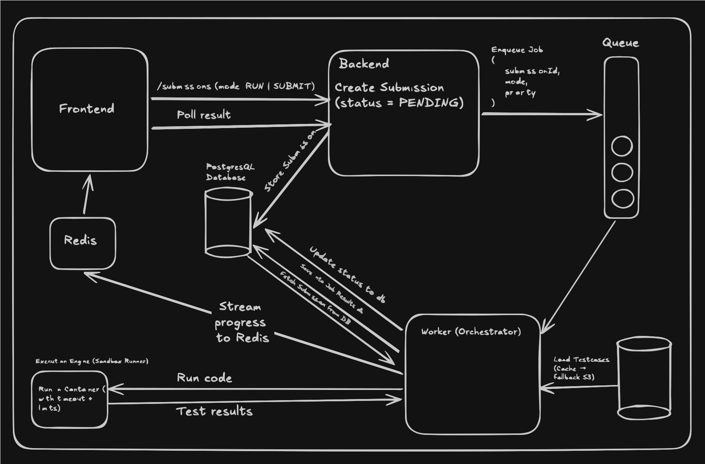

# CodeSM - Scalable Coding Platform

CodeSM is a robust, multi-role platform where creators publish coding problems and users solve them. Built for scale, it features secure code execution, real-time submission tracking, problem authoring, profiles, and more.

🎥 **[Watch the Project Walkthrough Video](https://drive.google.com/file/d/14yYXcVnDkhD8G58OHCsVnmVJN5C3Xait/view?usp=sharing)**

---

## 🚀 Key Features

- **Unified Execution Pipeline**: Both `RUN` and `SUBMIT` actions follow a consistent, scalable queue-based architecture with database persistency.
- **Secure Sandboxed Execution**: User submissions are safely compiled and executed within isolated Docker containers via dedicated BullMQ workers.
- **Efficient Test Case Management**: Test cases are stored individually in Postgres and fetched lazily from S3 by the worker, preventing memory bloat under high load.
- **Problem Creation & Verification**: Granular problem storage separating metadata, tags, and test cases. Includes an automated verification API to ensure S3 test case uploads succeed.
- **Roles & Profiles**: Separate flows for Creators (problem authoring) and Users (solving problems).
- **Rate Limiting & Reliability**: Built-in mechanisms to prevent abuse and ensure system stability.

## 🏗 System Architecture & Design

CodeSM recently underwent a major architectural overhaul, migrating from MongoDB to PostgreSQL and refining the core execution and problem creation workflows for enterprise-grade scalability.

### Unified RUN and SUBMIT Flow
Previously, `RUN` and `SUBMIT` had disjointed pipelines, leading to traceability and retry issues. The new architecture unifies them:
1. **Frontend** requests `/submissions` with `mode = RUN | SUBMIT`.
2. **Backend** creates a `PENDING` submission entry in PostgreSQL.
3. **Queue**: Only the lightweight `submissionId` is enqueued to BullMQ (backed by Redis), keeping the queue payload minimal.
4. **Worker**: Dequeues the job, fetches necessary data from the DB, runs the code in a Docker Sandbox, streams progress to Redis, and saves the final result to the DB.
5. **Data Lifecycle**: `RUN` executions generate temporary data. A cron job automatically cleans up these entries after 1-6 hours to optimize storage.

### Problem Creation & Test Case Optimization
To address memory bottleneck issues under heavy load:
- **Granular Storage**: Migrated from a single monolithic problems table to dedicated tables for problem metadata, tags, test cases, and editorials.
- **Lazy Loading Test Cases**: Instead of the worker downloading all test cases at once (which could cause massive spikes in data transfer), each testcase has its own DB entry and S3 key. The worker fetches only what it needs, exactly when it needs it.
- **Verification API**: Ensures problem test cases are successfully written to S3 before finalizing problem creation.

### Shared Database Schema (`db-schema`)
To maintain consistency between the Express backend and the Docker-backed workers, the Drizzle-ORM PostgreSQL schema is extracted into its own dedicated package (`db-schema`). This ensures a single source of truth for all database models and migrations across the monorepo, avoiding duplication and mismatch errors.



## 💻 Tech Stack

- **Backend**: Node.js, Express, PostgreSQL, Drizzle-ORM
- **Frontend**: React, Vite, Tailwind CSS
- **Queues & Caching**: Redis, BullMQ
- **Workers**: Node.js, Docker (Sandboxed Execution Engine)
- **Storage**: AWS S3 (for test cases)

## 📁 Repository Layout

This monorepo is organized into the following runnable packages:

| Package | Role |
|---------|------|
| [`backend/`](backend/) | Express API, PostgreSQL/Drizzle, Redis/BullMQ producer, S3 Integration |
| [`db-schema/`](db-schema/) | Shared Drizzle-ORM PostgreSQL schema definitions for backend and workers |
| [`Frontend/`](Frontend/) | React + Vite Single Page Application |
| [`workers/`](workers/) | BullMQ workers, Docker execution engine, Redis consumer |

## 🛠 Quick Start

### 1. Clone the repository
```bash
git clone https://github.com/shivamxverma/codesm.git
cd codesm
```

### 2. Infrastructure Requirements
Ensure you have the following services running locally or remotely:
- **PostgreSQL**
- **Redis**
- **Docker** (Required by the worker for the execution sandbox)
- **AWS S3** (or a local equivalent)

### 3. Backend Setup
```bash
cd backend
npm install
```
Create a `.env` file in the `backend/` directory with your `DATABASE_URL` (Postgres), `REDIS_URL`, JWT secrets, and AWS S3 credentials.
```bash
npm run dev
```
*API runs on `http://localhost:8000` by default.*

### 4. Frontend Setup
```bash
cd ../Frontend
npm install
```
Configure your `.env` file with `VITE_API_URL` pointing to the backend.
```bash
npm run dev
```
*Frontend runs on `http://localhost:5173`.*

### 5. Worker Setup (Execution Engine)
```bash
cd ../workers
npm install
```
Configure `.env` with `DATABASE_URL`, `REDIS_URL`, and S3 credentials.
**Ensure the Docker daemon is running** so the worker can spin up sandbox containers.
```bash
npm start
```

## 🔐 Environment Variables Summary

Make sure to securely configure your `.env` files across the three packages.
- **Backend**: `DATABASE_URL`, `PORT`, `REDIS_URL`, AWS credentials, JWT Secret.
- **Frontend**: `VITE_API_URL`, `VITE_GOOGLE_CLIENT_ID`.
- **Workers**: `DATABASE_URL`, `REDIS_URL`, AWS S3 credentials.

---
*Built with a focus on scale, reliability, and developer experience.*

// Contributed via automated bounty system
