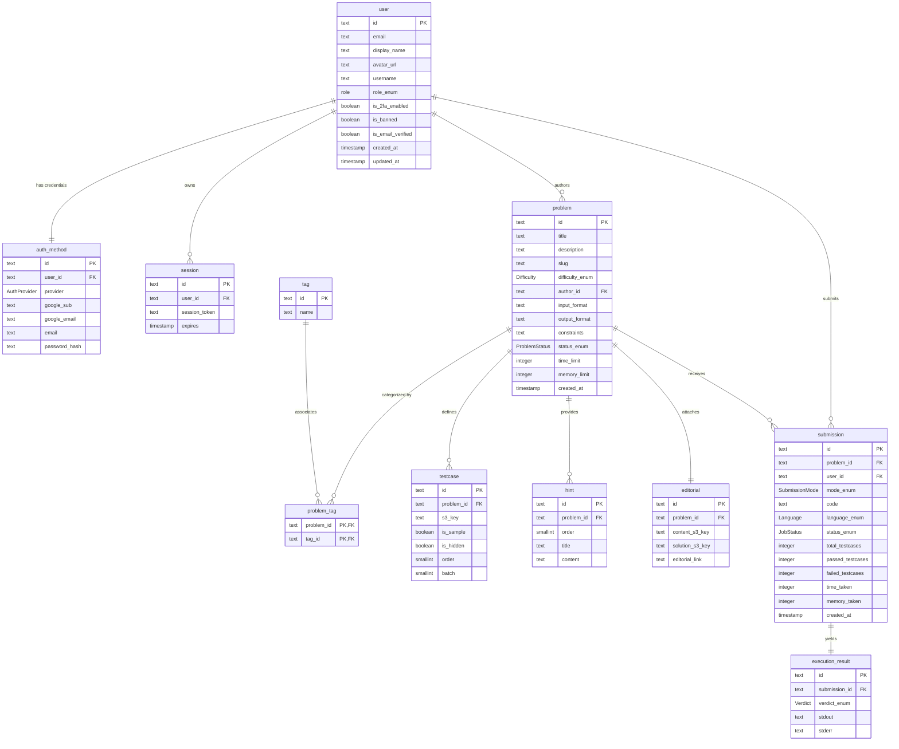

# CodeSM Platform Codebase & Architecture Analysis

Welcome to the comprehensive codebase and architecture reference for **CodeSM**, a scalable, multi-role competitive programming and AI-assisted interviewing platform. 

This document details the software design, directory layouts, database schema relations, asynchronous execution pipeline, sandbox security boundaries, and AI integrations.

---

## 1. High-Level System Architecture

CodeSM decouples HTTP request handling from resource-heavy code compilation and execution. The platform utilizes a queue-driven, sandboxed workflow to guarantee safety, fair scheduling, and high availability.

### Unified Solution Submission & Grading Pipeline
The diagram below illustrates how solutions are submitted, queued, compiled, and validated:

```mermaid
sequenceDiagram
    autonumber
    actor User as Developer Browser
    participant FE as Frontend (React + Vite)
    participant BE as Backend (Express API)
    participant DB as Postgres (Drizzle ORM)
    participant RD as Redis (BullMQ)
    participant WK as Async Worker
    participant S3 as AWS S3 Storage
    participant DK as Docker Sandbox

    User->>FE: Click "Submit"
    FE->>BE: POST /api/v1/submission/:problemId/submit (code, language)
    BE->>DB: Insert Submission (status: 'PENDING')
    BE->>RD: Enqueue job-payload on 'submit-queue' (submissionId, limits, details)
    BE-->>FE: Return 200 { status: 'success', submissionId }
    FE->>FE: Begin status polling / listener

    RD->>WK: Dequeue job
    WK->>DB: Update Submission status to 'RUNNING'
    WK->>WK: Create temp directories & write source code to host disk
    WK->>DK: Build compile commands inside ephemeral build container (if compiled)
    DK-->>WK: Return compilation binary/artifacts
    Note over WK, DK: If compilation fails, early-exit with COMPILE_ERROR

    WK->>DK: Spin up a persistent sleep container with dropped privileges & resource limits
    loop For each test case in problem
        WK->>S3: Lazily download individual testcase input/output JSON
        WK->>DK: Docker exec testcase input into execution binary in /tmp (read-write tmpfs)
        DK-->>WK: Capture stdout, stderr, execution duration, and exit status
        Note over WK: Compare stdout with expected S3 output
        alt Output Mismatch or Error (TLE/MLE/RTE)
            Note over WK: Mark failed; break loop early (Early-Exit Optimization)
        end
    end
    WK->>DK: Destroy container & clean up host filesystem directories
    WK->>DB: Insert Execution Result & update Submission (status: 'COMPLETED'/'FAILED', verdict)
    WK->>RD: Update Redis submission status cache key
    FE->>BE: Poll /api/v1/submission/:submissionId
    BE->>RD: Fetch Redis status state (fall back to Postgres if cached key expired)
    BE-->>FE: Return final submission status and execution metrics
```

> [!NOTE]
> The system architecture recently migrated from MongoDB to PostgreSQL, enabling schema-enforced relational consistency via Drizzle ORM. 

---

## 2. Monorepo Directory Layout

The codebase is organized as a monorepo containing runnable services, shared packages, E2E tests, and utility scripts:

| Package / Directory | Role | Key Technologies |
| :--- | :--- | :--- |
| [`db-schema/`](file:///Users/shivamverma/Desktop/personal-work/CodeSM/db-schema/) | Shared database schema definition package. Used by both `backend` and `workers` to enforce a single source of truth for queries and models. | TypeScript, Drizzle ORM, PostgreSQL |
| [`backend/`](file:///Users/shivamverma/Desktop/personal-work/CodeSM/backend/) | Main REST API service. Responsible for authorization, problem authoring, submission routing, AI generation, and database interactions. | Node.js, Express, TypeScript, BullMQ, AWS SDK, Google Generative AI |
| [`workers/`](file:///Users/shivamverma/Desktop/personal-work/CodeSM/workers/) | Asynchronous job consumer. Handles file handling, compilation, persistent Docker management, and individual code grading. | Node.js, JavaScript, Docker (Engine CLI), BullMQ, AWS SDK |
| [`Frontend/`](file:///Users/shivamverma/Desktop/personal-work/CodeSM/Frontend/) | Single Page Application (SPA). Admin and user dashboards, code editor IDE interface, contest lobby, and AI interview simulator. | React, Vite, Tailwind CSS, Lucide Icons, Axios |
| [`tests/`](file:///Users/shivamverma/Desktop/personal-work/CodeSM/tests/) | Automated E2E verification suites. Simulates user auth, problem list views, layouts, and page navigation. | Playwright, TypeScript |
| [`docs/`](file:///Users/shivamverma/Desktop/personal-work/CodeSM/docs/) | Developer guidelines, local setup references, auth flow explanations, and arch specs. | Markdown |

---

## 3. Shared Database Schema (`db-schema`)

The PostgreSQL schema is managed under [`db-schema/src/db/schema.ts`](file:///Users/shivamverma/Desktop/personal-work/CodeSM/db-schema/src/db/schema.ts). Relationships are defined in [`db-schema/src/db/relations.ts`](file:///Users/shivamverma/Desktop/personal-work/CodeSM/db-schema/src/db/relations.ts).

### Relational Schema Diagram
The core entities are structured as follows:



### Key Schema Optimizations
* **Profile / Credentials Split**: Social logins and raw credentials are decoupled by separating user profiles (`user` table) from authentication methods (`auth_method` table). 
* **Composite Keys**: The junction table `problem_tag` enforces a composite primary key `(problemId, tagId)` to prevent duplicate tag associations.
* **Specialized Indexing**:
  * `submission_user_problem_idx` indexes `(userId, problemId)` to maximize queries pulling a specific developer's historic attempts for a problem.
  * `execution_result_submission_verdict_idx` indexes `(submissionId, verdict)` since the grading UI queries both fields together on submission pages.
  * Extraneous indexing (like `updatedAt` timestamps) is stripped to avoid insertion write overhead.

---

## 4. Backend Application (`backend`)

The Express REST API is built in TypeScript and manages core routes, authentication states, rate limiting, and integrations with external AI models and AWS S3.

### API Endpoints (under prefix `/api/v1`)
Active routing definitions are exposed through [`backend/src/api/index.ts`](file:///Users/shivamverma/Desktop/personal-work/CodeSM/backend/src/api/index.ts):

* **`/auth`** ([`auth-route.ts`](file:///Users/shivamverma/Desktop/personal-work/CodeSM/backend/src/api/auth/auth-route.ts))
  * `POST /register`: Registers user with email/password credentials.
  * `GET /verify-email`: Verifies token sent via registration mail.
  * `POST /login`: Authenticates user and issues HTTP-Only secure cookies containing tokens.
  * `GET /google`: Initiates Google OAuth sequence.
  * `GET /google/callback`: Finalizes token exchange and redirects back to the frontend dashboard.
  * `GET /me`: Returns the authenticated user profile (requires valid token cookie/header).
* **`/problem`** ([`problem-route.ts`](file:///Users/shivamverma/Desktop/personal-work/CodeSM/backend/src/api/problem/problem-route.ts))
  * `POST /create`: Creates draft problem shell and returns S3 presigned upload URLs (requires `ADMIN`/`AUTHOR` role).
  * `POST /finalize`: Confirms all test cases and editorials are successfully uploaded to S3 and changes status to `DONE`.
  * `GET /`: Lists active problems using cursor-based pagination.
  * `GET /:problemId`: Retrieves specific problem metadata along with its sample test cases.
  * `GET /:problemId/hints`: Retrieves hints, dynamically generating them using Gemini AI if not pre-existing.
* **`/submission`** ([`submission-route.ts`](file:///Users/shivamverma/Desktop/personal-work/CodeSM/backend/src/api/submission/submission-route.ts))
  * `POST /:problemId/:mode`: Submits code or requests sample dry run execution (`mode = RUN | SUBMIT`).
  * `GET /:submissionId`: Polls compilation status or verdict.
  * `GET /:submissionId/result`: Fetches stdout/stderr metrics and detailed grading outcomes.
* **`/interview`** ([`interview-route.ts`](file:///Users/shivamverma/Desktop/personal-work/CodeSM/backend/src/api/interview/interview-route.ts))
  * `POST /`: Generates structured mock interview questions utilizing candidates' resume context.
  * `POST /score`: Evaluates candidate's written mock-interview answer and generates analytical scoring.

### Advanced Features & Integrations
* **Cryptographically Signed OAuth States**: To protect against State Fixation CSRF attacks, the Google login path signs target frontend origins inside a signed JWT state. The callback verify checks the signature before processing the OAuth code.
* **AI Hint Generation**: Implemented in [`problem-helper.ts`](file:///Users/shivamverma/Desktop/personal-work/CodeSM/backend/src/api/problem/problem-helper.ts#L22). Uses a structured `gemini-2.5-flash` model to analyze problems (difficulty, constraints, description) and generate 4 progressive hints without giving away the final solution.
* **Mock Interview Assistant**: Implemented in [`interview-service.ts`](file:///Users/shivamverma/Desktop/personal-work/CodeSM/backend/src/api/interview/interview-service.ts). Customizes questions for DSA, Low-Level Design (LLD), System Design, or Behavioral rounds using candidate resume profiles.
* **Speech Synthesis Integration**: Text questions created by the AI interviewer are automatically posted to Murf AI (`/v1/speech/generate`) to synthesize voice audio, creating an interactive audio-visual simulator.

---

## 5. Sandboxed Code Execution Worker (`workers`)

The execution engine is an asynchronous BullMQ processor that runs compiler toolchains inside containerized isolation environments.

### The Sandbox Runner Container
The compilation and execution are containerized using a custom Debian-based image defined in [`workers/docker/sandbox-runner/Dockerfile`](file:///Users/shivamverma/Desktop/personal-work/CodeSM/workers/docker/sandbox-runner/Dockerfile):
* **Supported Languages**:
  * **C / C++**: `gcc` / `g++` (utilizes `-O2 -std=c++17` standard)
  * **Java**: `openjdk-17-jdk-headless` (Main class loader)
  * **Go**: `golang` (compiled)
  * **Python**: `python3` (interpreted, run with `-B` to suppress `.pyc` creation)
  * **JavaScript**: `nodejs` (interpreted execution)

### Strict Security Policies & Container Enforcements
To protect the host engine filesystem and OS kernel from malicious code submissions, the worker implements sandbox enforcements ([`language.js`](file:///Users/shivamverma/Desktop/personal-work/CodeSM/workers/src/code/language.js#L21-L41) & [`docker.js`](file:///Users/shivamverma/Desktop/personal-work/CodeSM/workers/src/code/docker.js#L15-L36)):
1. **Network Disabling**: Containers are spawned using `--network none` to prevent user scripts from sending outbound queries or calling external webhooks.
2. **File Permissions**: The main code directory is mounted strictly read-only (`-v ${runnerDir}:/host_code:ro`).
3. **Execution Isolation**: Runs with a read-only root system file layout (`--read-only`). The application binary executes inside a temporary `tmpfs` disk partition (`/tmp:rw,nosuid,nodev,exec,size=64m`) which is swept clean between subsequent executions.
4. **Dropped Capabilities**: The execution environment drops all kernel capabilities (`--cap-drop ALL`) and prevents escalation privileges (`no-new-privileges:true`).
5. **Resource Constraints**:
  * Memory limits are enforced at the Docker engine layer (`--memory 256m --memory-swap 256m`).
  * Process thread counts are limited (`--pids-limit 32`) to block fork-bombs.
  * CPU execution quotas are limited (`--cpus 0.5`).
6. **Execution Deadlines**: Each run command uses the Linux `timeout` utility. Exiting with error code `124` triggers a **Time Limit Exceeded (TLE)** error. Exiting with `137` triggers a **Memory Limit Exceeded (MLE)** error.

### Optimized Exec Lifecycle (Persistent Sleep Container)
Rather than spinning up a new Docker container for each test case—which incurs roughly ~300ms boot latency—the worker uses a persistent container cycle:
1. Dequeues submission and spins up **one** persistent Docker container running `sleep infinity` ([`docker.js`](file:///Users/shivamverma/Desktop/personal-work/CodeSM/workers/src/code/docker.js#L15)).
2. Compiles code inside a temporary compile container (skipped for Python/Node).
3. Evaluates all test cases in sequence using rapid **`docker exec`** calls, which execute in less than **5ms**.
4. Implements an **early-exit optimization**: once a single test case yields a failure (Wrong Answer, TLE, MLE, or Runtime Error), it immediately breaks out of the loop and shuts down the container, freeing system resources.
5. Lazily pulls individual test cases from AWS S3, checking inputs and outputs on the fly to avoid buffering large payloads in worker memory.

---

## 6. Frontend Application (`Frontend`)

The client interface is a React application built with Vite and Tailwind CSS. The routing architecture is defined in [`App.jsx`](file:///Users/shivamverma/Desktop/personal-work/CodeSM/Frontend/src/App.jsx):

* **Guest Routing**: `/login`, `/signup`, `/forgot-password`, `/reset-password/:token`, and `/oauth-success`.
* **Authenticated Routing**:
  * `/` & `/dashboard`: Displays developer statistics, past submissions, and recently solved problems.
  * `/problems` & `/problems/:id`: Coding interface featuring an editor panel, sample test results, submit buttons, problem description, dynamic AI hints, and community discussion tabs.
  * `/createproblem` & `/contests/create`: Problem configuration panel, allowing creators to define description schemas, limits, and upload S3 content files.
  * `/interview`: Interactive audio/text interface designed to simulate coding and system design interviews.
* **Role Based Permissions**: Enforced client-side via [`RequireRole.jsx`](file:///Users/shivamverma/Desktop/personal-work/CodeSM/Frontend/src/hooks/RequireRole.jsx) wrapping paths to lock out non-author/admin users from creating problems and contests.

---

## 7. End-to-End Testing (`tests/`)

To prevent regressions across complex pipelines, CodeSM provides Playwright E2E tests configured inside [`playwright.config.ts`](file:///Users/shivamverma/Desktop/personal-work/CodeSM/playwright.config.ts).

* **Available Tests**:
  * `auth.spec.ts`: Sign-in forms, signup logic, input validations, and error handling.
  * `problems.spec.ts`: Checks problem navigation, list views, and submission editor layout.
  * `homepage.spec.ts` & `navigation.spec.ts`: Core layout elements, navigation menus, and responsiveness checks.
* **Testing Infrastructure**:
  * Tests can run locally or in containerized mode using docker-compose.
  * The orchestration configuration in [`docker-compose.e2e.yml`](file:///Users/shivamverma/Desktop/personal-work/CodeSM/docker-compose.e2e.yml) handles dependencies, building the Vite frontend container, waiting for health checks, and running tests via a Playwright container matching local dependencies exactly.

---

## 8. Summary of Configurations & Environment Variables

To run CodeSM locally or in production, configure environment variables across components:

### Backend `.env`
* `PORT`: Server port (default: `8000`)
* `DATABASE_URL`: PostgreSQL connection string (Drizzle ORM target)
* `REDIS_URL`: Redis server URL (BullMQ client interface)
* `ACCESS_TOKEN_SECRET` / `REFRESH_TOKEN_SECRET`: Keys for signing JWT tokens
* `AWS_ACCESS_KEY_ID` / `AWS_SECRET_ACCESS_KEY` / `AWS_BUCKET_NAME` / `AWS_REGION`: Amazon S3 upload configurations
* `GEMINI_API_KEY`: API key for generative artificial intelligence (hints, interview scoring)
* `MURF_API_KEY`: Audio voice synthesis API authorization key

### Workers `.env`
* `DATABASE_URL`: PostgreSQL connection string
* `REDIS_URL`: Redis server URL
* `AWS_ACCESS_KEY_ID` / `AWS_SECRET_ACCESS_KEY` / `AWS_BUCKET_NAME` / `AWS_REGION`: Amazon S3 read configurations

### Frontend `.env`
* `VITE_API_URL`: Backend URL (e.g., `http://localhost:8000/api/v1`)
* `VITE_GOOGLE_CLIENT_ID`: Google Client ID for credentials integration
