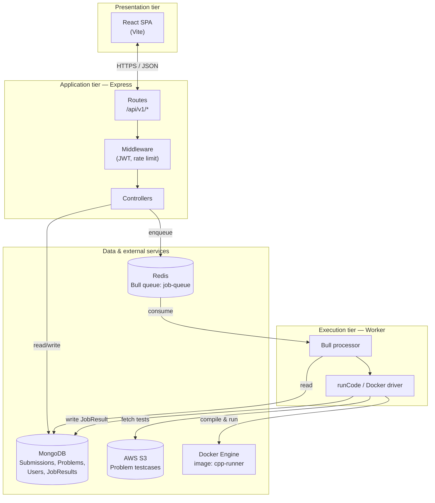
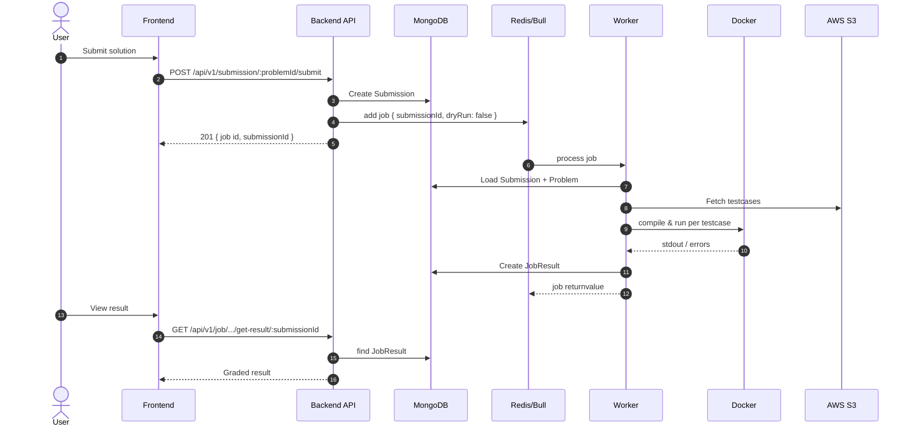
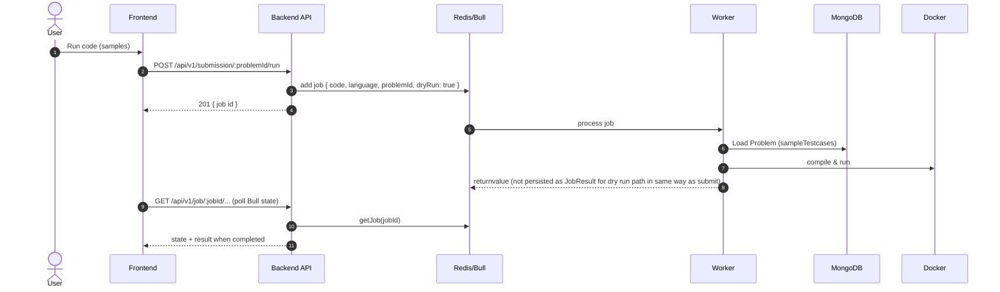

# CodeSM — Software design architecture

This document describes the software design of CodeSM: major components, responsibilities, and how requests flow through the system for code submission and execution.

## 1. Design goals

- **Decouple HTTP from execution**: The API accepts submissions quickly; heavy work runs out-of-process.
- **Fair scheduling**: A single queue (`job-queue`) serializes execution work and scales with worker processes.
- **Isolation**: User code runs inside a **Docker** image (`cpp-runner`) with resource limits.
- **Durable outcomes**: Submissions and graded results are stored in **MongoDB**; optional polling uses **Bull/Redis** job state.

## 2. Logical layers

| Layer | Components | Responsibility |
|-------|--------------|----------------|
| **Presentation** | React (Vite) SPA | Auth UI, problem view, submit/run, poll job or fetch result |
| **Application API** | Express (`backend`) | REST routes, JWT, validation, enqueue jobs, read `JobResult` |
| **Async execution** | Bull worker (`workers`) | Dequeue jobs, load problem/submission, run Docker, persist results |
| **Infrastructure** | Redis, MongoDB, AWS S3, Docker | Queue backing store, documents, remote testcases, sandbox |

## 3. Component diagram

## 4. Key runtime boundaries

- **API process** never runs user code; it only validates, persists `Submission`, and pushes a job payload to Bull.
- **Worker process** owns Docker invocations and testcase loading (S3 for full submit; sample cases from `Problem` for dry run).
- **Redis** holds Bull job metadata and return values until TTL; **MongoDB** holds the authoritative `JobResult` for submit flows.

## 5. Sequence: submit and grade

## 6. Sequence: dry run (sample cases)

## 7. API surface (execution-related)

| Method | Path | Role |
|--------|------|------|
| POST | `/api/v1/submission/:problemId/submit` | Create submission, enqueue grade job |
| POST | `/api/v1/submission/:problemId/run` | Enqueue dry-run job |
| GET | `/api/v1/job/:jobId/problems/:problemId` | Poll Bull job (generic) |
| GET | `/api/v1/job/:jobId/submissions/:submissionId/dry-run` | Poll dry-run job |
| GET | `/api/v1/job/:jobId/get-result/:submissionId` | Fetch persisted `JobResult` from MongoDB |

Routes require JWT where defined in route modules.

## 8. Failure and scaling notes

- **Worker down**: Jobs remain in Redis until processed or expired; users see “processing” or timeout on poll.
- **Multiple workers**: Bull can run several worker processes against the same queue name; jobs are distributed safely.
- **Docker/S3 errors**: Worker returns structured errors; submit path may still record `JobResult` with rejected or error semantics depending on implementation in `runCode.js`.

---

*Generated for the CodeSM monorepo; implementation details live under `backend/`, `workers/`, and `Frontend/`.*
