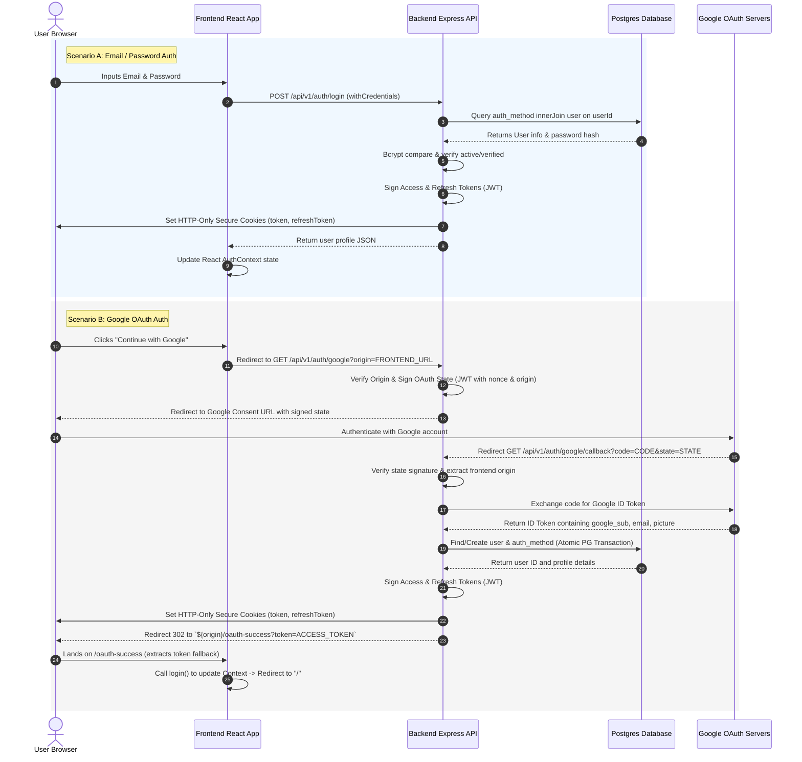

# Complete Authentication Architecture Reference

This document details the production-grade authentication architecture implemented in the project. It provides a complete reference from database schema definitions up to frontend UI context, client routing protections, and cross-site cookie security configurations.

---

## 1. High-Level Process Flow



---

## 2. Database Schema Definition (Postgres + Drizzle ORM)

The database structure decouples the public-facing **User Profile** fields from internal **Authentication Identity** records. This enables multiple sign-in methods (credentials, Google, Github, etc.) for a single user without cluttering the main profile table with nullable credential columns.

### Tables (`db-schema/src/db/schema.ts`)

#### A. User Table (`user`)
Stores user status, username, email, display details, verification status, and system roles.
```typescript
import { pgTable, text, timestamp, boolean, uniqueIndex, pgEnum } from 'drizzle-orm/pg-core';
import { createId } from '@paralleldrive/cuid2';
import { sql } from 'drizzle-orm';

export const roleEnum = pgEnum('role', ['ADMIN', 'AUTHOR', 'USER']);

export const user = pgTable(
    'user',
    {
        id: text('id').primaryKey().notNull().$defaultFn(() => createId()),
        email: text('email'),
        displayName: text('display_name'),
        avatarUrl: text('avatar_url'),
        username: text('username').notNull(),
        role: roleEnum('role').notNull().default('USER'),
        is2FaAuthEnabled: boolean('is2fa_auth_enabled').default(false).notNull(),
        isBanned: boolean('is_banned').default(false).notNull(),
        isEmailVerified: boolean('is_email_verified').default(false).notNull(),
        verificationToken: text('verification_token'),
        createdAt: timestamp('created_at', { precision: 3, mode: 'string' })
            .default(sql`(now() AT TIME ZONE 'UTC'::text)`)
            .notNull(),
        updatedAt: timestamp('updated_at', { precision: 3, mode: 'string' })
            .default(sql`(now() AT TIME ZONE 'UTC'::text)`)
            .notNull(),
    },
    (table: any) => [
        uniqueIndex('user_email_key').using('btree', table.email.asc().nullsLast()),
        uniqueIndex('user_username_key').using('btree', table.username.asc().nullsLast()),
    ],
);
```

#### B. Authentication Method Table (`auth_method`)
Contains login secrets. A 1:1 mapping with the `user` table is maintained via a unique index on `userId`.
```typescript
export const authProvider = pgEnum('AuthProvider', [
    'GOOGLE_OAUTH',
    'EMAIL_PASSWORD',
]);

export const authMethod = pgTable(
    'auth_method',
    {
        id: text('id').primaryKey().notNull().$defaultFn(() => createId()),
        userId: text('user_id').notNull(),
        provider: authProvider('provider').notNull(),
        // Google OAuth Fields
        googleSub: text('google_sub'),
        googleEmail: text('google_email'),
        // Email/Password Fields
        email: text('email'),
        passwordHash: text('password_hash'),
        createdAt: timestamp('created_at', { precision: 3, mode: 'string' })
            .default(sql`(now() AT TIME ZONE 'UTC'::text)`)
            .notNull(),
        updatedAt: timestamp('updated_at', { precision: 3, mode: 'string' })
            .default(sql`(now() AT TIME ZONE 'UTC'::text)`)
            .notNull(),
    },
    (table: any) => [
        uniqueIndex('auth_method_google_email_key').using('btree', table.googleEmail.asc().nullsLast()),
        uniqueIndex('auth_method_google_sub_key').using('btree', table.googleSub.asc().nullsLast()),
        uniqueIndex('auth_method_user_id_key').using('btree', table.userId.asc().nullsLast()),
        foreignKey({
            columns: [table.userId],
            foreignColumns: [user.id],
            name: 'auth_method_user_id_fkey',
        })
        .onUpdate('cascade')
        .onDelete('cascade'),
    ],
);
```

---

## 3. Backend Implementation (Express)

### A. Routes (`backend/src/api/auth/auth-route.ts`)
```typescript
import { Router } from "express";
import { validate, verifyJWT } from '../../shared/middleware';
import { emailPasswordRegister, verifyEmail, emailPasswordLogin, initiateGoogleAuth, googleOAuthCallback, getCurrentUser } from './auth-controller';
import { emailPasswordLoginSchema, emailPasswordRegisterSchema } from "./auth-schema";

const router = Router();

router.post("/register", validate('body', emailPasswordRegisterSchema), emailPasswordRegister);
router.get("/verify-email", verifyEmail);
router.post("/login", validate('body', emailPasswordLoginSchema), emailPasswordLogin);

router.get('/google', initiateGoogleAuth);
router.get('/google/callback', googleOAuthCallback);
router.get("/me", verifyJWT, getCurrentUser);

export default router;
```

### B. Security Middleware (`backend/src/shared/middleware.ts`)
Validates incoming access tokens. It supports tokens extracted from the HTTP `Authorization` header (`Bearer <token>`) as well as browser cookies (`cookies.token`). If authentication is successful, the current database state is loaded and assigned to `req.user`.

```typescript
export const verifyJWT = asyncHandler(async (req: jwtReq, res: Response, next: NextFunction) => {
    try {
        const token = req.headers.authorization?.startsWith('Bearer ')
            ? req.headers.authorization.split(' ')[1]
            : req.cookies?.token;

        if (!token) {
            throw new ApiError('Unauthorized Request: No token provided', 401);
        }

        const decodedToken = jwt.verify(token, env.ACCESS_TOKEN_SECRET) as UserJwtPayload;
        const users = await db.select().from(userTable).where(eq(userTable.id, decodedToken.userId));

        if (!users || users.length === 0) {
            throw new ApiError('Invalid Access Token', 401);
        }

        req.user = users[0];
        next();
    } catch (error: any) {
        return res.status(401).json({
            status: 'error',
            message: 'Unauthorized Request'
        });
    }
});
```

### C. JWT Handling & Safe Cookie Settings (`backend/src/shared/jwt.ts` & `shared/helper.ts`)
Tokens are signed securely and sent back inside `httpOnly` secure cookies.

```typescript
// Token Generation (jwt.ts)
export const generateTokenPair = (payload: UserJwtPayload) => {
  const accessToken = jwt.sign(payload, env.ACCESS_TOKEN_SECRET, { expiresIn: '30d' });
  const refreshToken = jwt.sign(payload, env.REFRESH_TOKEN_SECRET, { expiresIn: '1y' });

  return { accessToken, refreshToken };
};

// Transport Cookies Configuration (shared/helper.ts)
export const jwtCookieOptions = (origin: string, isRefreshToken: boolean) => {
  const isProd = process.env.NODE_ENV === 'production';

  return {
    httpOnly: true, // Safeguard: prevents client XSS scripts from reading cookies
    secure: true,   // Safeguard: requires HTTPS
    sameSite: isProd ? 'lax' : 'none',
    path: '/',
    domain: isProd ? '.yourdomain.com' : undefined,
    maxAge: isRefreshToken ? 365 * 24 * 60 * 60 * 1000 : 30 * 24 * 60 * 60 * 1000,
  };
};
```

### D. Cryptographically-Signed Google OAuth (`backend/src/loaders/googleOAuth.ts`)
To prevent **State Fixation CSRF attacks** and **open redirect vulnerabilities**, the state parameter sent to Google is cryptographically signed using a backend JWT secret. This signed payload verified on redirect callback ensures that redirect origins are authentic.

```typescript
// Generate securely signed state and authorize URL
export const buildGoogleAuthUrl = (origin: string): string => {
  if (!isAllowedOrigin(origin)) {
    throw new Error('Origin not allowed');
  }

  const nonce = crypto.randomBytes(16).toString('hex');
  const state = jwt.sign({ origin, nonce }, env.JWT_SECRET, { expiresIn: '10m' });

  return googleOAuthClient.generateAuthUrl({
    access_type: 'offline',
    prompt: 'consent',
    scope: ['openid', 'email', 'profile'],
    state,
    redirect_uri: env.GOOGLE_REDIRECT_URI,
  });
};

// Verify State in OAuth Callback (auth-controller.ts)
export const googleOAuthCallback = asyncHandler(async (req: jwtReq, res: Response) => {
    const code = req.query.code as string | undefined;
    const state = req.query.state as string | undefined;

    if (!code || !state) {
        throw new ApiError('Missing code or state', 400);
    }

    // Verify cryptographic signature of oauth state
    const { origin } = jwt.verify(state, env.JWT_SECRET) as { origin: string };
    if (!isAllowedOrigin(origin)) {
        throw new Error('Invalid origin in OAuth state');
    }

    const response = await handleGoogleOauth({ isVerify: false, code, credential: '' });
    setAuthCookies(res, response, origin);
    
    // Safely redirect back to frontend application landing page
    res.redirect(302, `${origin}/oauth-success?token=${response.accessToken}`);
});
```

---

## 4. Next.js Frontend Integration (App Router + Server Actions + Middleware)

Next.js App Router allows us to implement a highly optimized authentication flow. Instead of managing local storage, we rely entirely on secure, HTTP-only cookies in Next.js Server Actions and Edge Middleware. This results in:
* **Zero Client-Side JS Execution for Protection**: Block unauthenticated layout rendering instantly at the Edge before rendering any HTML.
* **No Layout Shift/Flash**: Server Components pre-hydrate the user session, eliminating loading skeletons and "flashes" of unauthenticated content.
* **XSS Defeat**: Tokens never touch client-side `localStorage`.

### A. Next.js Edge Middleware (`middleware.ts`)
Placed at the root of the project. Next.js middleware intercepts requests at the routing layer, parsing the secure HTTP-Only cookie, and redirecting instantly without loading any client bundles.

```typescript
import { NextResponse } from 'next/server';
import type { NextRequest } from 'next/server';

const PROTECTED_ROUTES = ['/dashboard', '/interview', '/createproblem'];
const AUTH_ROUTES = ['/login', '/signup'];

export function middleware(request: NextRequest) {
  const token = request.cookies.get('token')?.value;
  const { pathname } = request.nextUrl;

  // 1. Check if route is protected
  const isProtectedRoute = PROTECTED_ROUTES.some(route => pathname.startsWith(route));
  const isAuthRoute = AUTH_ROUTES.some(route => pathname.startsWith(route));

  // 2. Redirect rule: If protected route & no token, redirect to login
  if (isProtectedRoute && !token) {
    const url = new URL('/login', request.url);
    url.searchParams.set('callbackUrl', pathname); // Store redirect target
    return NextResponse.redirect(url);
  }

  // 3. Redirect rule: If auth route & token exists, redirect to dashboard
  if (isAuthRoute && token) {
    return NextResponse.redirect(new URL('/dashboard', request.url));
  }

  return NextResponse.next();
}

export const config = {
  // Run middleware on all routing paths except public static assets and API routes
  matcher: ['/((?!api|_next/static|_next/image|favicon.ico).*)'],
};
```

### B. Server Actions for Session Handling (`app/actions/auth.ts`)
Server Actions run on the server side but are called like normal async functions. They can modify incoming and outgoing cookies securely.

```typescript
'use server';

import { cookies } from 'next/headers';
import { redirect } from 'next/navigation';

const API_BASE = process.env.NEXT_PUBLIC_API_URL || 'http://localhost:8000/api/v1';

export async function loginAction(formData: FormData) {
  const email = formData.get('email');
  const password = formData.get('password');

  if (!email || !password) {
    return { error: 'Email and password are required' };
  }

  try {
    const response = await fetch(`${API_BASE}/auth/login`, {
      method: 'POST',
      headers: { 'Content-Type': 'application/json' },
      body: JSON.stringify({ email, password }),
    });

    const data = await response.json();

    if (!response.ok || !data.success) {
      return { error: data.message || 'Authentication failed' };
    }

    // Set secure HTTP-only session cookies directly on the server
    const cookieStore = cookies();
    cookieStore.set('token', data.data.accessToken, {
      httpOnly: true,
      secure: process.env.NODE_ENV === 'production',
      sameSite: 'lax',
      path: '/',
      maxAge: 30 * 24 * 60 * 60, // 30 days
    });

    if (data.data.refreshToken) {
      cookieStore.set('refreshToken', data.data.refreshToken, {
        httpOnly: true,
        secure: process.env.NODE_ENV === 'production',
        sameSite: 'lax',
        path: '/',
        maxAge: 365 * 24 * 60 * 60, // 1 year
      });
    }
  } catch (error) {
    return { error: 'Something went wrong. Please try again.' };
  }

  redirect('/dashboard');
}

export async function logoutAction() {
  const cookieStore = cookies();
  cookieStore.delete('token');
  cookieStore.delete('refreshToken');
  redirect('/login');
}
```

### C. Server-Hydrated Client Context (`app/components/AuthProvider.tsx`)
If Client Components need user metadata (e.g. displayName/avatar in navigation bars), we pass a pre-fetched user profile down from the Server Component layout into a lightweight React Context. This guarantees instant UI loading without any layout shift.

```tsx
'use client';

import React, { createContext, useContext, useState } from 'react';

type UserProfile = {
  id: string;
  email: string;
  username: string;
  role: 'USER' | 'AUTHOR' | 'ADMIN';
};

const AuthContext = createContext<{
  user: UserProfile | null;
  setUser: React.Dispatch<React.SetStateAction<UserProfile | null>>;
}>({ user: null, setUser: () => {} });

export function AuthProvider({
  children,
  initialUser,
}: {
  children: React.ReactNode;
  initialUser: UserProfile | null;
}) {
  const [user, setUser] = useState<UserProfile | null>(initialUser);

  return (
    <AuthContext.Provider value={{ user, setUser }}>
      {children}
    </AuthContext.Provider>
  );
}

export const useUser = () => useContext(AuthContext);
```

### D. Layout Server Fetching (`app/layout.tsx`)
In Next.js, layouts are Server Components by default. We fetch the user info securely on the server and pass it down to hydrate the `AuthProvider` immediately.

```tsx
import { cookies } from 'next/headers';
import { AuthProvider } from './components/AuthProvider';

async function getSessionUser() {
  const token = cookies().get('token')?.value;
  if (!token) return null;

  try {
    const response = await fetch(`${process.env.NEXT_PUBLIC_API_URL}/auth/me`, {
      headers: {
        Authorization: `Bearer ${token}`,
      },
      next: { revalidate: 300 }, // Cache user profile for 5 minutes
    });

    const body = await response.json();
    return body.success ? body.data : null;
  } catch {
    return null;
  }
}

export default async function RootLayout({
  children,
}: {
  children: React.ReactNode;
}) {
  const user = await getSessionUser();

  return (
    <html lang="en">
      <body>
        <AuthProvider initialUser={user}>
          {children}
        </AuthProvider>
      </body>
    </html>
  );
}
```

### E. Server Component Protection & RBAC (`app/admin/page.tsx`)
To guard page routing on individual Server Components (e.g. admin panels), block rendering and redirect on the server.

```tsx
import { cookies } from 'next/headers';
import { redirect } from 'next/navigation';

async function getSessionUser() {
  const token = cookies().get('token')?.value;
  if (!token) return null;

  try {
    const res = await fetch(`${process.env.NEXT_PUBLIC_API_URL}/auth/me`, {
      headers: { Authorization: `Bearer ${token}` }
    });
    const body = await res.json();
    return body.success ? body.data : null;
  } catch {
    return null;
  }
}

export default async function AdminDashboard() {
  const user = await getSessionUser();

  // Redirect instantly on the server side
  if (!user) {
    redirect('/login');
  }

  if (user.role !== 'ADMIN') {
    redirect('/dashboard');
  }

  return (
    <main className="p-8">
      <h1 className="text-3xl font-bold">Admin Dashboard</h1>
      <p>Secure administrative settings, rendered fully on the server.</p>
    </main>
  );
}
```

---


## 5. Security Safeguards Checklist for Reuse

* **HTTP-Only Cookies (`httpOnly: true`)**: Makes auth tokens invisible to JavaScript, neutralizing XSS credential extraction.
* **State Parameter Signing**: Digitally signing OAuth state vectors checks validity and redirects destination origins safely.
* **Separation of Concerns**: De-coupling public user columns (`user`) and mapping relational tokens separately (`auth_method`) ensures cleaner growth and identity integration.
* **Transactional integrity**: Social logins or signup insertions are wrapped in an atomic transaction statement (`db.transaction()`) to prevent partial failures.
* **Tab synchronization**: Listening to storage change events ensures all opened sub-tabs log out or in synchronously when credentials expire.
